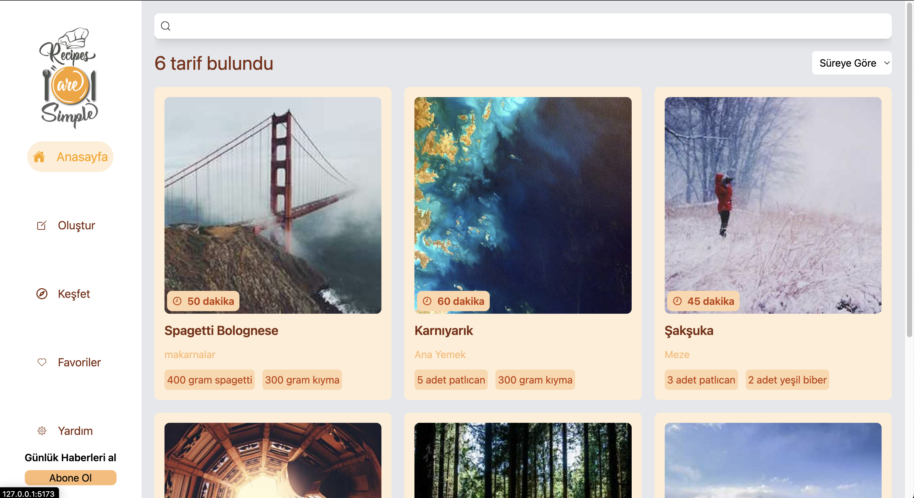
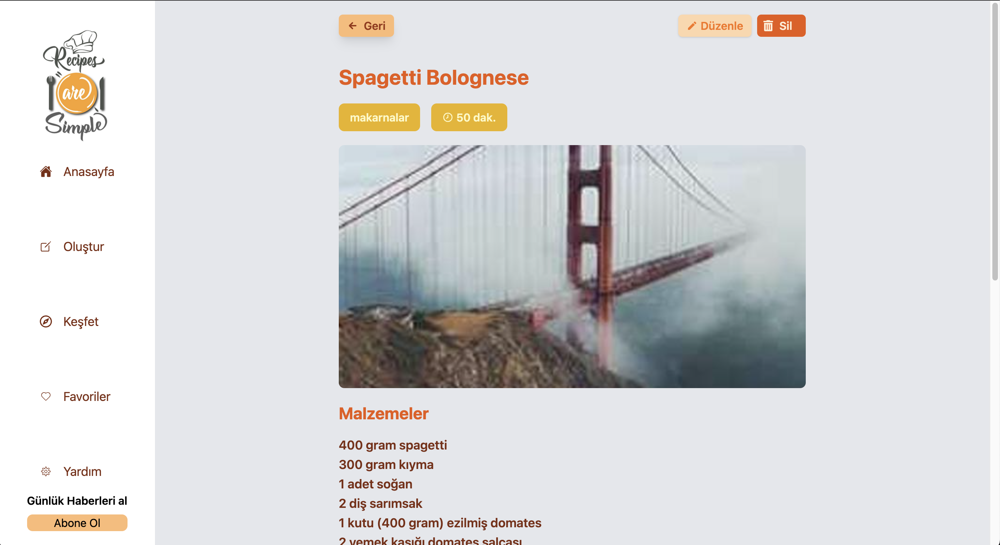
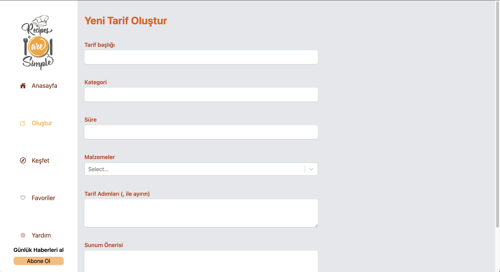

# Full-Stack Recipe App

This project is a full-stack application where users can view, create, update, and manage their favorite recipes. It features a user-friendly interface for easy navigation and interaction. The backend is built using **Node.js** and **Express.js**, while the frontend is developed with **React (Vite)**.

### Video gif


## Screenshots

### Main Page



### Detail Page



### Create page



## Features

- **Home Screen**: Displays a list of all available recipes.
- **Detail Screen**: Shows detailed information about a selected recipe.
- **Create Screen**: Allows users to create and add new recipes.
- **Update Screen**: Enables users to edit existing recipes.
- **Undefined Screen**: Handles non-existing routes.

## Tech Stack

- **Frontend**: React (Vite)

  - Styled using **Tailwind CSS**
  - Key libraries used:
    - `@uidotdev/usehooks`: For custom hooks.
    - `axios`: For making HTTP requests.
    - `react-icons`: For adding icons.
    - `react-router-dom`: For routing.
    - `react-select`: For dropdown selections.
    - `react-toastify`: For notifications.

- **Backend**: Node.js

  - The API is built with Express.js, and data is stored in a **data.json** file.

- **Images**: Sourced dynamically from **lorempicsum**, providing random placeholder images for recipes.

## Setup

1. Clone the repository:

   ```bash
   git clone https://github.com/ozerbaykal/express_fullstack-recipe.git

   ```

2. Install the dependencies:

   ```
   cd client
   npm install
   ```

3. Run the client

   ```
   npm run dev
   ```

4. Install backend dependencies:

   ```
      npm start
   ```

   <h2>Contributing</h2>

Contributions are welcome! Please open an issue first to discuss what you would like to change.

- 1.Fork the project
- 2.Create your feature branch (git checkout -b feature/NewFeature)
- 3.Commit your changes (git commit -m 'Add new feature')
- 4.Push to the branch (git push origin feature/NewFeature)
- 5.Open a Pull Request

<h2>Contact</h2>

Özer BAYKAL mail : baykalozer87@gmail.com
